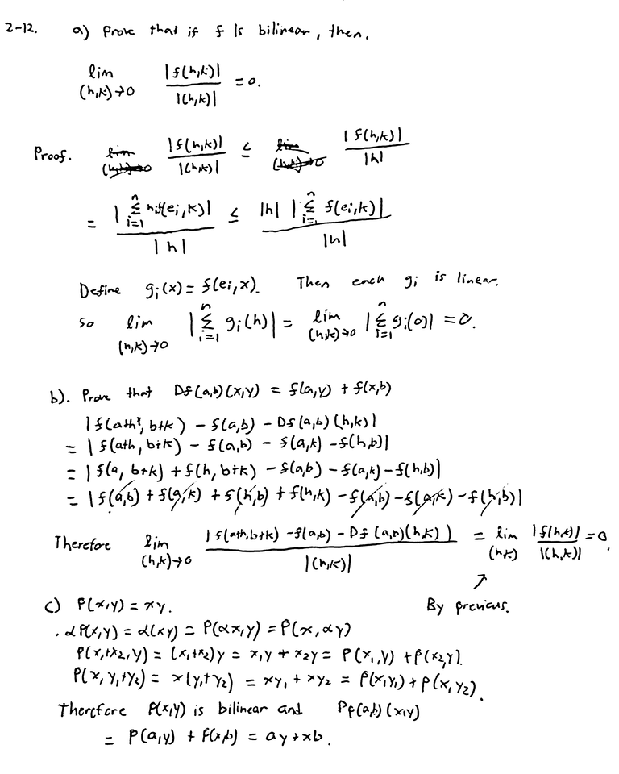
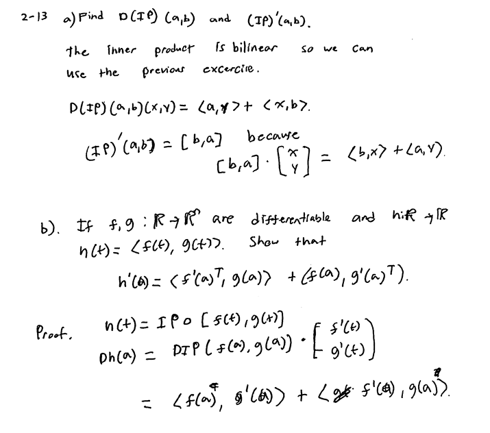
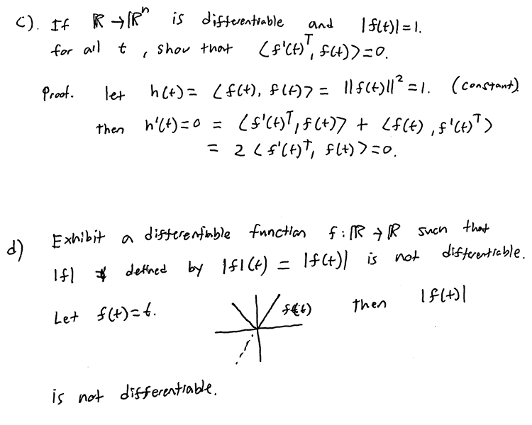
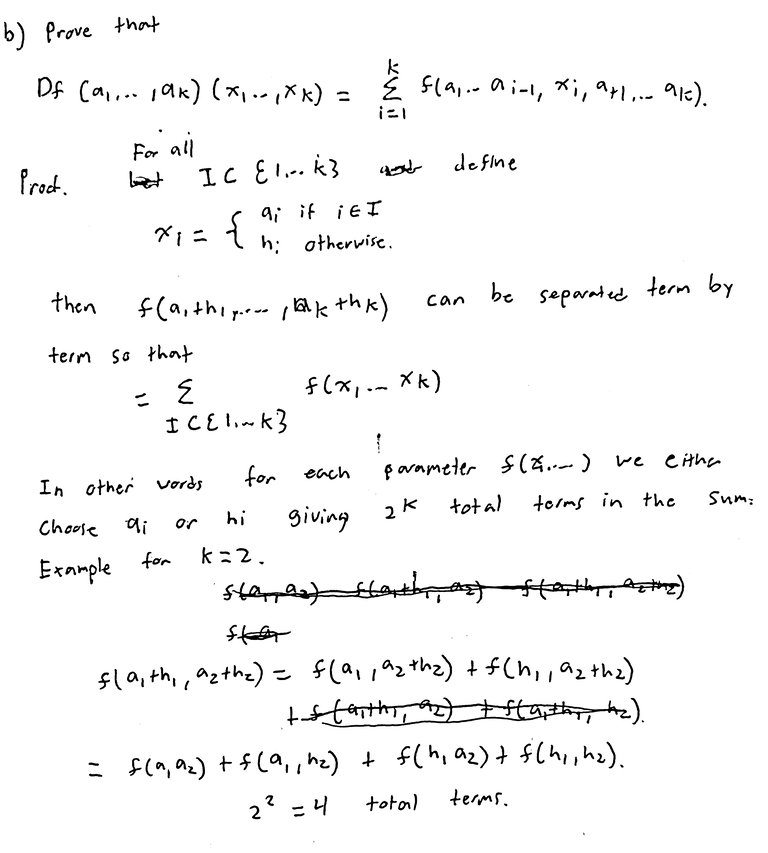
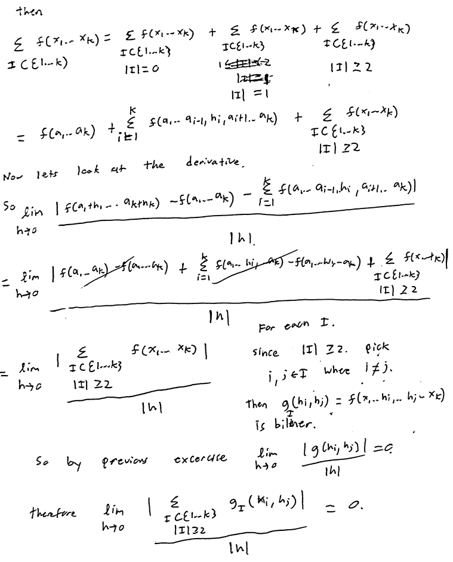
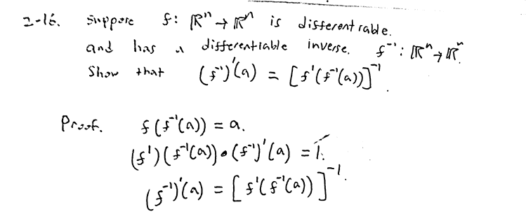

# Problem Set 2.2

## 2-10

## 2-12

## 2-13

https://math.stackexchange.com/questions/1334759/total-derivative-of-inner-product

## 2-14

This problem was pretty difficult.
I looked at a lot of other "hand waving" answers and material
before I could figure out what was going on.
I tried to exposit on the key ideas.

https://math.stackexchange.com/questions/65686/total-derivative-and-multilinear-functions

https://en.wikipedia.org/wiki/Multilinear_map

## 2-15

(Skipped)

## 2-16

