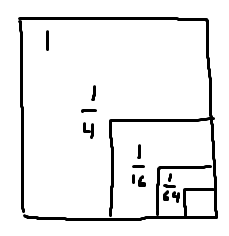
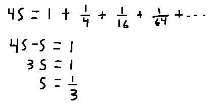

How much memory does a full mipmap chain use?

Let's draw a picture:

And write that as a sum:

Use a trick to solve for the sum:

But wait, a mipmap chain isn't an infinite series. It has finite number of terms since it stops at 1. So the 1/3 is actually an upper bound.

To get the exact:

Alternatively you could solve it with a recurrence:

